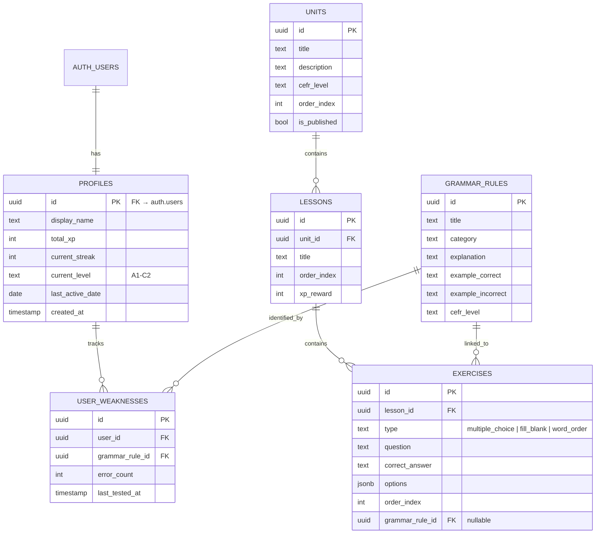

# Lingua ERD (Entity Relationship Diagram)

## Visual Diagram (Mermaid)



## Relationships

| From | To | Type | FK Column |
|------|----|------|-----------|
| `profiles` | `auth.users` | 1:1 | `profiles.id` |
| `lessons` | `units` | N:1 | `lessons.unit_id` |
| `exercises` | `lessons` | N:1 | `exercises.lesson_id` |
| `exercises` | `grammar_rules` | N:1 (nullable) | `exercises.grammar_rule_id` |
| `user_weaknesses` | `profiles` | N:1 | `user_weaknesses.user_id` |
| `user_weaknesses` | `grammar_rules` | N:1 | `user_weaknesses.grammar_rule_id` |

## CEFR Level Hierarchy

```
A1 (Beginner) → A2 (Elementary) → B1 (Intermediate) → B2 (Upper Intermediate) → C1 (Advanced) → C2 (Proficiency)
```

XP thresholds: A1=0, A2=200, B1=500, B2=1000, C1=2000, C2=4000
